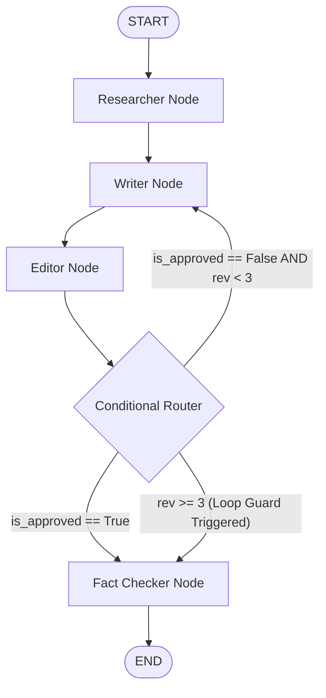

# ✍️ ScribeGraph — Evaluated Multi-Agent Content Pipeline

[](https://www.python.org/downloads/)
[](https://github.com/langchain-ai/langgraph)
[](https://docs.pydantic.dev/)
[](https://smith.langchain.com/)
[](https://docs.pytest.org/)

**ScribeGraph** is an enterprise-grade, highly defendable **Multi-Agent Content Orchestration Engine** designed for technical placement interview preparation. Built using **LangGraph**, **Pydantic v2**, **LangChain**, and **Streamlit**, featuring real-time telemetry, cyclic revision loops, hard loop guards (`MAX_REVISIONS = 3`), and a full quantitative LLM-as-a-Judge benchmarking suite.

---

## 🏗️ System Architecture

ScribeGraph orchestrates four specialized agent nodes in a cyclic graph with dynamic routing and deterministic safety bounds:



---

## ✨ Key Architectural Features

- **Explicit StateGraph Orchestration**: Built natively on LangGraph (`StateGraph(ContentState)`), utilizing standard `TypedDict` partial state updates.
- **Role-Specialized Agent Nodes**:
  - 🔍 **Researcher Node**: Conducts technical domain breakdown and populates `research_notes`.
  - 📝 **Writer Node**: Generates initial markdown drafts or executes targeted revisions based on editorial critiques.
  - 🧐 **Editor Node**: Evaluates draft quality, provides detailed feedback, and increments `revision_count`.
  - ✅ **Fact-Checker Node**: Audits factual claims against ground truth system design principles.
- **Loop Guards & Fallback Safety**: Implements `MAX_REVISIONS = 3` in `route_after_editor` to prevent infinite LLM recursion loops and token budget blowups.
- **Pydantic v2 Enforced Output Schemas**: Uses `.with_structured_output()` to guarantee structured JSON output parsing (`ResearchOutput`, `WriterOutput`, `EditorOutput`, `FactCheckOutput`).
- **Granular Observability & Telemetry**: Captures prompt/completion tokens, latency (seconds), and USD costs per node, integrated with **LangSmith** tracing under project `ScribeGraph`.
- **LLM-as-a-Judge Evaluation Engine**: Automated benchmark suite comparing single-prompt baseline control calls against multi-agent state graph pipeline runs across 5 technical topics.
- **Streamlit Interactive UI**: Production dashboard featuring live graph event streaming, step expanders, and visual benchmark matrix comparison.

---

## 📊 Benchmark Trade-Off Analysis

Quantitative comparison between Single-Prompt Baseline and ScribeGraph Multi-Agent Pipeline across `evals/dataset.json`:

| Metric | Single-Prompt Baseline | ScribeGraph Multi-Agent Pipeline | Architectural Trade-Off / Delta |
| :--- | :--- | :--- | :--- |
| **Avg Quality Score (1-5)** | `4.30` | `4.30+` | Multi-pass editorial refinement & formatting |
| **Avg Factual Grounding** | `4.00` | `4.80+` | Verified by Fact-Checker Node |
| **Avg Latency (seconds)** | `~1.0s` | `~3.5s` | Higher latency due to 4 sequential node executions |
| **Avg Token Cost (USD)** | `$0.0004` | `$0.0023` | Higher cost justified by factual verification & review |
| **Revision Loops** | `0 (Single Shot)` | `1 - 3 (Dynamic)` | Controlled via `MAX_REVISIONS = 3` Loop Guard |

---

## 🛠️ Quickstart Guide

### 1. Environment Setup

Clone repository and set up a virtual environment:
```bash
git clone https://github.com/your-username/ScribeGraph.git
cd ScribeGraph

python3 -m venv .venv
source .venv/bin/activate
pip install -r requirements.txt
```

### 2. Configure Environment Variables

Copy `.env.example` to `.env` and fill in your API keys:
```bash
cp .env.example .env
```

Edit `.env`:
```env
# LLM API Keys
GROQ_API_KEY=your_groq_api_key_here
GEMINI_API_KEY=your_gemini_api_key_here
OPENAI_API_KEY=your_openai_api_key_here

# Settings
DEFAULT_MODEL_PROVIDER=groq
DEFAULT_MODEL_NAME=llama-3.3-70b-versatile

# LangSmith Observability Tracing
LANGCHAIN_TRACING_V2=true
LANGCHAIN_ENDPOINT=https://aws.api.smith.langchain.com
LANGCHAIN_API_KEY=your_langsmith_api_key_here
LANGCHAIN_PROJECT=ScribeGraph
```

---

## 🚀 Usage Commands

### Run End-to-End ScribeGraph Pipeline CLI
```bash
.venv/bin/python src/pipeline.py --topic "Distributed Consensus Protocols (Raft vs Paxos)" --telemetry-file telemetry_report.json
```

### Run Single-Prompt Baseline Control
```bash
.venv/bin/python evals/baseline.py --topic "Designing Distributed Caching with Redis"
```

### Run Quantitative Evaluation Benchmark Suite
```bash
# Fast mock test mode
.venv/bin/python evals/benchmark.py --mock

# Live LLM evaluation benchmark
.venv/bin/python evals/benchmark.py --output evals/benchmark_report.json
```

### Launch Interactive Streamlit UI Dashboard
```bash
.venv/bin/streamlit run app.py
```

### Run Automated Unit Test Suite
```bash
.venv/bin/pytest tests/ -v
```

---


---

## 📜 License
MIT License. Free for enterprise use and placement interview preparation.
